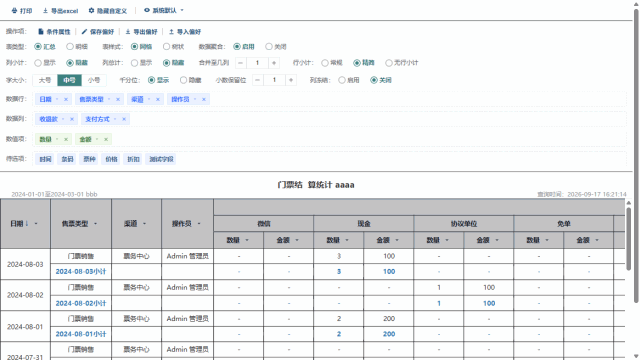

# cus_umytable

> 原生 JavaScript 透视表插件 · 零依赖 · 基于 umy-ui 透视表全部功能重写

[🔗 在线演示](https://acduan.github.io/cus_pivoTable-cus_umytable/cus_umytable/demo.html) · [压缩版演示](https://acduan.github.io/cus_pivoTable-cus_umytable/cus_umytable/dist/demo.min.html) · [MIT License](https://opensource.org/licenses/MIT)



## ✨ 功能特性

- **表类型**：汇总 / 明细
- **表样式**：网格 / 树状（多层表头、吸顶表头、虚拟滚动）
- **字段配置**：拖拽配置行 / 列 / 数值 / 隐藏字段
- **数据分析**：筛选、排序（升序 / 降序 / 按数量）、行小计、列小计、列总计
- **格式设置**：千分位、小数保留位、字号、列冻结、自定义拖拽列宽
- **条件属性**：if/else 表达式（赋值、单元格样式、链接），新值遵循千分位/小数位格式化
- **导出 Excel**：保留表格样式（黑色网格线、灰色表头、蓝色小计、行总计）、数字格式、冻结窗格
- **打印**：全量数据打印，自动去除表头筛选图标
- **偏好管理**：保存 / 加载 / 导入 / 导出（含自定义列宽）
- 零依赖，单文件引入即可使用

## 🚀 快速开始

```html
<!DOCTYPE html>
<html>
<head>
    <meta charset="UTF-8">
    <link rel="stylesheet" href="cus_umytable/cus_umytable.css">
</head>
<body>
    <div id="app"></div>
    <script src="cus_umytable/cus_umytable.js"></script>
    <script>
        const table = CusUmyTable.create('#app', {
            dataUrl: './components/report_data2.json',  // 数据源 JSON
            showToolbar: true,      // 显示工具栏（打印/导出/偏好）
            showConfig: true,       // 显示配置面板
            size: 'small'           // 整体尺寸：large / medium / small
        });
        window.cusTable = table;    // 暴露实例方便调试
    </script>
</body>
</html>
```

## 📊 数据格式

`dataUrl` 指向的 JSON 结构：

```json
{
  "report_descript": {
    "rpt_des_name": "报表标题",
    "rpt_des_remark": "查询说明",
    "rpt_cfg_type": "summary",
    "rpt_cfg_contentType": "grid",
    "rpt_cfg_separator": "true",
    "rpt_cfg_decimalPlaces": 1,
    "rpt_cfg_frozenCols": 1,
    "rpt_cfg_filterlist": {}
  },
  "datalist": [
    { "日期": "2024-08-03", "售票类型": "门票销售", "渠道": "票务中心", "数量": 3, "金额": 100 }
  ]
}
```

字段说明可参考仓库中的 [演示数据](components/report_data2.json)。

## 📦 文件结构

```
├── components/                     演示数据
│   ├── report_data2.json           常规演示数据
│   └── report_data3.json           大数据演示数据
├── cus_umytable/                   插件源码与演示
│   ├── cus_umytable.js             插件主体（原生JS，零依赖）
│   ├── cus_umytable.css            插件样式
│   ├── demo.html                   演示页
│   ├── test_report_data3.html      大数据演示页
│   ├── assets/demo.gif             README 演示动画
│   └── dist/                       压缩版（min.js / min.css / demo.min.html）
└── index.html                      跳转到演示页
```

## 🔧 浏览器支持

Chrome / Edge / Firefox 等现代浏览器。

## 📄 License

[MIT](https://opensource.org/licenses/MIT)
